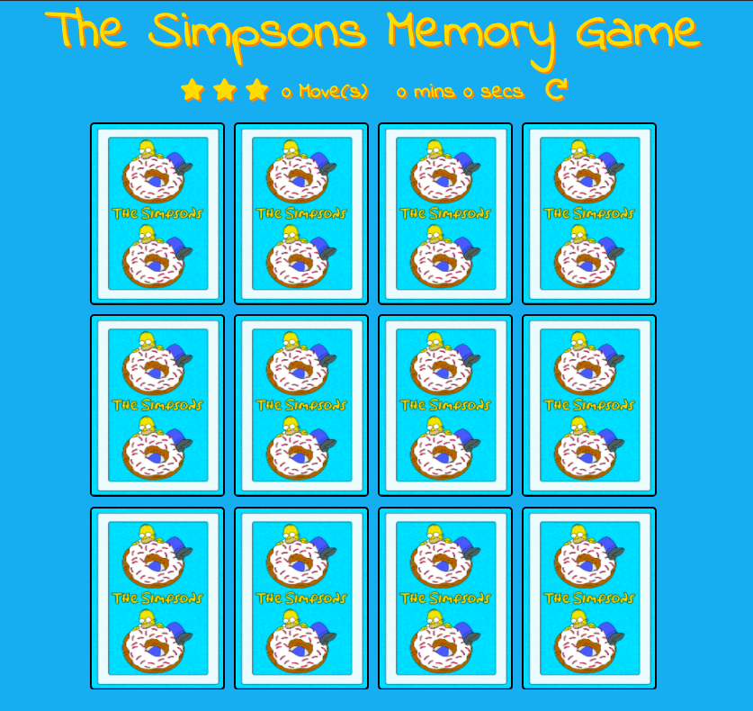

<h1 align="center">Mile Stone Project Two</h1>

[View full webpage here](https://podgecollins.github.io/MilesStoneProjectTwo_MemoryGame/) 

This web site is a simple single-player Simpsons themed card-matching memory game.

<h2 align="center"></h2>

# UX User Experience:

## User stories:

### First Time Visitor Goals:
    -As a First Time Visitor, I want to easily understand how to play the game.

    -As a First Time Visitor, I want to clearly see my progress while playing.

### Returning Visitor Goals:
    -As a Returning Visitor, I want to be able to complete the game knowing I
    got a better score than last time.

## Design:

### Colour Scheme:
    -The main colours used are Yellow for the text, icons and time. The background colour of the site
    is a sky blue. The cards consist of the same colours 

### Typography:
    -The Indie Flower font is the main font used throughout the whole website 
    with Sans Serif as the fallback font in case for any reason the font 
    isn't being imported into the site correctly. Indie Flower is a clean font 
    that closely resembles the original Simpson font, so it felt most appropriate.

### Imagery:
    -The imagery was important as the main purpose of the game is match cards. 
    I needed to have fun and recognisible images for the user to match. Thats why I chose 
    to make the game Simpsons themed. 

## Wireframes: 

Original Desktop Wireframe - [View](https://www.figma.com/file/BtBv8y0RpWvrDAnMww7T1R/Mile-Stone-Two---Memory-Game?node-id=0%3A1)

# Features:

    Responsive on all Devices 

    Interactives Elements

# Technologies Used:

## Languages Used:

    HTML 5

    CSS

    Javascript

## Frameworks, Libraries and Programs Used:

### Bootstrap v 4.2.1
    - This was used to help with responsiveness and styling of website 

### Google Fonts
    -Used to import Indie Flower font into my style.css

### Font Awesome
    -Used for the star icons on index.html

### Git 
    -Used for version control by utilizing the gitpod terminal to commit to 
    Git and Push to github

### Github
    -Used to store repositories 

### Photoshop
    -Used to create and edit the Simpsons themed cards.

### Figma
    -Used to create the wireframes of what I wanted my website to look like

# Testing 

The W3C Markup Validator and W3C CSS Validator Services were used to validate every 
page of the project to ensure there were no syntax errors in the project.

W3C Markup Validator - [Results](https://github.com/PodgeCollins/MilesStoneProjectTwo_MemoryGame/blob/master/validation%20images/W3C%20Markup%20Validator.png)

W3C CSS Validator - [Results](http://jigsaw.w3.org/css-validator/validator$link)

## Testing User Stories from User Experience (UX) Section:

### First Time Visitor Goals:

#### As a First Time Visitor, I want to easily understand how to play the game:

    - Upon entering the site, users are automatically greeted with a clear and easily
    legible title, 'The Simpsons Memory Game'. 
    Underneath there is 12 back facing cards, upon clicking the first card the timer starts
    and the move counter goes up, indicating the game has started.

    - The user can restart the game at the click of a button. 

#### As a First Time Visitor, I want to clearly see my progress while playing:

    - Above the cards the user can see a star rating, move counter and timer 
    displaying the users progress as the game is played.

### Returning Visitor Goals:

#### As a Returning Visitor, I want to be able to complete the game knowing I
    got a better score than last time:

    - Once the game is completed a modal will display showing the users time, move count
    and star rating along with a play again button that restarts the game allowing the
    user to try and beat their score. 
    -There is also a reset button above the cards on the right letting the user start again
    at any point in the game.

## Furthur Testing:

    -The Website was tested on Google Chrome, Safari & Internet Explorer 

    -It was viewed on a variety of devices such a Laptop, Tablet, iPhone and Oneplus5.

    -A large amount of testing was done to ensure the javascript worked on numerous devices.

    -My brother was asked to review the site and documentation to point out any bugs and/or 
    user experience issues.

## Known Bugs

    -When you click the restart button you can see at least one of the cards new location 
    after being flipped & shuffle.

    -Website is limited to Google chrome.

    -Website displays in Safari but the flipCard function isnt working as expected. 
    When clicking a card the class of flip is added, however the card only displays the 
    front facing image for a second before flipping back over.
    The move counter, timer and star rating all work correctly. 
    
    -Website displays in Internet Explorer but none of the elements on the page are responsive.
    Cards dont flip upon click and timer doesnt start. 

# Deployment:

## GitHub Pages:

### The project was deployed to GitHub Pages using the following steps:

1. Log in to GitHub and locate the [GitHub Repository](https://github.com/)
    
2. At the top of the Repository (not top of page), locate the "Settings" 
   Button on the menu.

3. Scroll down the Settings page until you locate the "GitHub Pages" Section.
    
4. Under "Source", click the dropdown called "None" and select "Master Branch".

5. The page will automatically refresh.
    
6. Scroll back down through the page to locate the now published site link in the 
"GitHub Pages" section.

## Forking the GitHub Repository:

### By forking the GitHub Repository we make a copy of the original repository on our GitHub account to view and/or make changes without affecting the original repository by using the following steps:

1. Log in to GitHub and locate the [GitHub Repository](https://github.com/)
    
2. At the top of the Repository (not top of page) just above the "Settings" 
   Button on the menu, locate the "Fork" Button.
    
3. You should now have a copy of the original repository in your GitHub account.

### Making a Local Clone:

1. Log in to GitHub and locate the [GitHub Repository](https://github.com/)

2. Under the repository name, click "Clone or download".

3. To clone the repository using HTTPS, under "Clone with HTTPS", copy the link.
    
4. Open Git Bash
    
5. Change the current working directory to the location where you want the cloned 
   directory to be made.

6. Type git clone, and then paste the URL you copied in Step 3.

$ git clone https://podgecollins.github.io/MilesStoneProjectTwo_MemoryGame/  

7. Press Enter. Your local clone will be created.

$ git clone https://podgecollins.github.io/MilesStoneProjectTwo_MemoryGame/
    
    > Cloning into `CI-Clone`...
    > remote: Counting objects: 10, done.
    > remote: Compressing objects: 100% (8/8), done.
    > remove: Total 10 (delta 1), reused 10 (delta 1)
    > Unpacking objects: 100% (10/10), done.

Click [Here](https://docs.github.com/en/free-pro-team@latest/github/creating-cloning-and-archiving-repositories/cloning-a-repository#cloning-a-repository-to-github-desktop) to retrieve pictures for some of the buttons and more detailed explanations of the above process.

### 

# Credits

## Code:

    I used Marina Ferreira (https://marina-ferreira.github.io/projects/js/memory-game/)
    youtube tutorial and the Scotch (https://scotch.io/tutorials/how-to-build-a-memory-matching-game-in-javascript) javascript tutorial.

## Content:

    All content was written by developer

## Media:

    All Simpsons content on index.html was taken from a free png site and 
    can be located [here](http://pngimg.com/images/heroes/simpsons)

## Acknowledgements: 

    Thank you to my mentor was reviewing my work and assisting me with gaining
    a better understanding of Javascript.